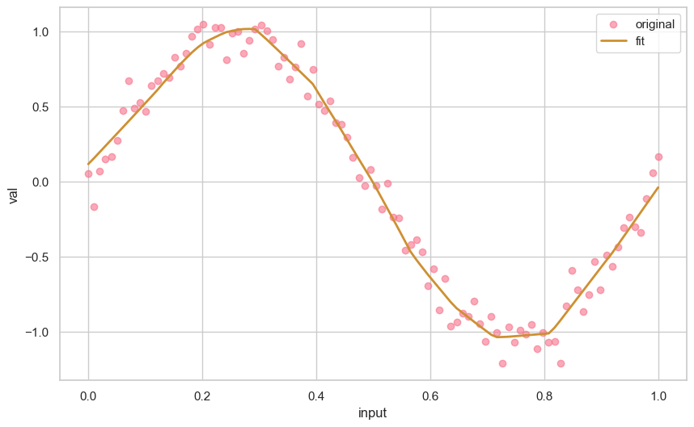

# Faster KANs

## Fast Kolmogorov-Arnold Networks (KANs)

Experiments in making KANs faster (or, what if we get rid of local b-splines and use ReLUs instead).

People already beat me to it (https://arxiv.org/abs/2406.02075) so this was a good low hanging fruit idea after all. Go read that paper instead.

